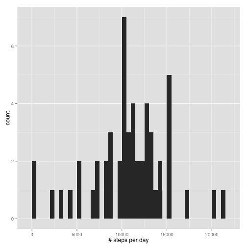
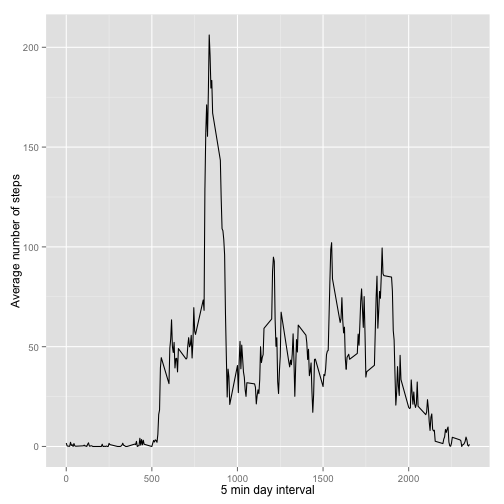
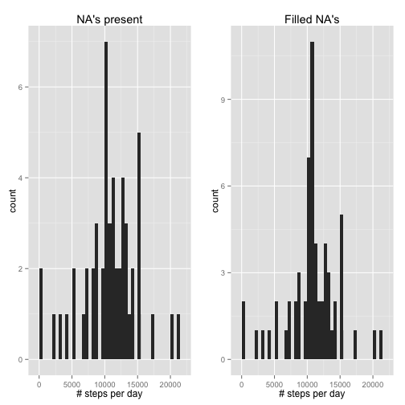
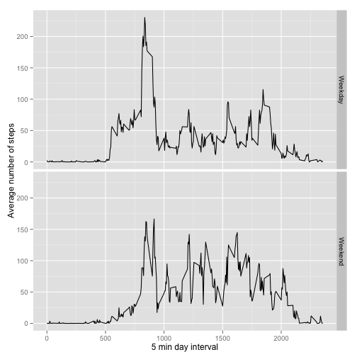

## Loading and preprocessing the data

Define global options for the whole document and required libraries are loaded.
Data are read from the zipped file.

```r
knitr::opts_chunk$set(echo=TRUE, warning=FALSE, output=TRUE)
```


```r
library(data.table)
```

```
## data.table 1.9.4  For help type: ?data.table
## *** NB: by=.EACHI is now explicit. See README to restore previous behaviour.
```

```r
library(ggplot2)
library(chron)
library(plyr)
library(gridExtra)
```

```
## Loading required package: grid
```

```r
unzip('./activity.zip')
file <- './activity.csv'

data <- data.table(read.csv(file))
data$date <- as.Date(data$date)
```

## What is mean total number of steps taken per day?

Histogram of number of steps per day

```r
daySteps <- data[,list(total=sum(steps)),by=date]
plot1 <- qplot(daySteps$total,binwidth=10) + 
        geom_histogram(binwidth=500) +
        xlab("# steps per day") +
        ylab("count")
plot1
```

 

Mean and median number of steps per day:

```r
mean(daySteps$total)
```

```
## [1] NA
```

```r
median(daySteps$total)
```

```
## [1] NA
```

## What is the average daily activity pattern?

Time series for the average number of steps during the whole day, represented by the 5-min time interval

```r
dayActivity <- data[,list(total=mean(steps,na.rm=TRUE)),by=interval]
qplot(interval, total, data=dayActivity, geom="line")+
        xlab("5 min day interval") +
        ylab("Average number of steps")
```

 

Maximum number of steps reached on average at 5-minute interval

```r
dayActivity$interval[dayActivity$total == max(dayActivity$total)]
```

```
## [1] 835
```


## Imputing missing values

Detect the total number of missing values in the dataset

```r
idx <- is.na(data$steps)
sum(idx)
```

```
## [1] 2304
```

Filling in all of the missing values in the dataset. The average value for the interval is employed.

```r
# Show some of the missing step values before filling in
data[idx,]
```

```
##       steps       date interval
##    1:    NA 2012-10-01        0
##    2:    NA 2012-10-01        5
##    3:    NA 2012-10-01       10
##    4:    NA 2012-10-01       15
##    5:    NA 2012-10-01       20
##   ---                          
## 2300:    NA 2012-11-30     2335
## 2301:    NA 2012-11-30     2340
## 2302:    NA 2012-11-30     2345
## 2303:    NA 2012-11-30     2350
## 2304:    NA 2012-11-30     2355
```

```r
# Get corresponding interval index and fill in the missing values with the average number of steps
data$steps[idx] <- dayActivity$total[match(data$interval[idx],dayActivity$interval)]

# Show some of the missing step values after filling in
data[idx,]
```

```
##           steps       date interval
##    1: 1.7169811 2012-10-01        0
##    2: 0.3396226 2012-10-01        5
##    3: 0.1320755 2012-10-01       10
##    4: 0.1509434 2012-10-01       15
##    5: 0.0754717 2012-10-01       20
##   ---                              
## 2300: 4.6981132 2012-11-30     2335
## 2301: 3.3018868 2012-11-30     2340
## 2302: 0.6415094 2012-11-30     2345
## 2303: 0.2264151 2012-11-30     2350
## 2304: 1.0754717 2012-11-30     2355
```

Histogram of number of steps per day after filling in NA's (comparison against previous one,left)

```r
daySteps2 <- data[,list(total=sum(steps)),by=date]
plot2 <- qplot(daySteps2$total,binwidth=10) + 
        geom_histogram(binwidth=500) +
        xlab("# steps per day") +
        ylab("count") +
        ggtitle("Filled NA's")

plot1 <- plot1 + ggtitle("NA's present")

grid.arrange(plot1, plot2, ncol=2)
```

 

Mean and median number of steps per day after filling in NA's

```r
mean(daySteps2$total)
```

```
## [1] 10766.19
```

```r
median(daySteps2$total)
```

```
## [1] 10766.19
```

## Are there differences in activity patterns between weekdays and weekends?

In order to observe differences, the average activity pattern is computed segregated for weedays and weekends

```r
# Detect wether a day is week or weekend day
data$dayType <- as.factor(is.weekend(data$date))
levels(data$dayType)[levels(data$dayType)==TRUE]  <- "Weekend"
levels(data$dayType)[levels(data$dayType)==FALSE] <- "Weekday"

# Segment average activity by interval and day type
dayActivity2 <- data[,list(total=mean(steps,na.rm=TRUE)),by=list(interval,dayType)]

# Ploting
qplot(interval, total, data=dayActivity2, geom="line") + facet_grid(dayType~.) +
        xlab("5 min day interval") +
        ylab("Average number of steps")
```

 


